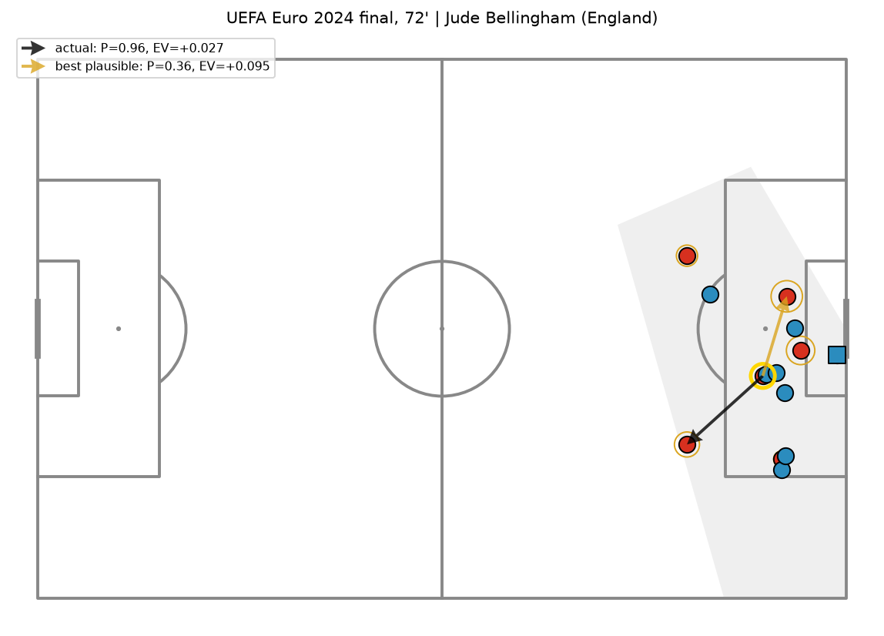

# The Pass He Didn't See

**Given where every visible player stood at the moment of a pass, what was the best option, and how does
the pass actually played compare?** A mini [TacticAI](https://www.nature.com/articles/s41467-024-45965-x) built
on free data: StatsBomb 360 freeze frames for 426 matches, plus SkillCorner broadcast tracking to measure
what those snapshots miss.



*Euro 2024 final, 72'. Bellingham lays it off to Palmer (P = 0.96), and Palmer scores. The model's best plausible
option was a riskier ball into the box (P = 0.36) with higher expected value. Both can be true: expected value is
an average over many replays of a moment, not a verdict on one.*

## What's in here

| milestone | question | headline result (held-out Euro 2024 unless stated, 95% CIs) |
|---|---|---|
| **M0 · Data** | Can anonymous freeze-frame dots be given labels? | 1.36M frames; corner first-touch labels by linking players across frames with Hungarian matching (~94% cross-method agreement) |
| **M1 · Corners** | Who touches a corner first? How should the defence adjust? | Graph network top-3 55% (48–63) vs 16% chance, tied with LightGBM; **beats it at predicting which team wins the first touch (AUC +0.08, 0.02–0.14)**. Defensive suggestions beat random moves, but only ~1/3 of the effect survives a different model family |
| **M2 · Pass value** | What's every passing option worth? | Pass completion AUC 0.912, calibrated. EV for 1.5M options, scored out-of-fold. **Unrestricted EV prefers far riskier passes than professionals play**, traced to a myopic value horizon and selection bias; fixed with a possession-level value and a model of what pros actually choose (top-3 90%) |
| **M3 · Velocity study** | What does a snapshot without velocities cost? | On 20 A-League matches of tracking: a 360-like snapshot loses only ΔAUC 0.006 (0.003–0.009), **all of it from the receiver's run**. The StatsBomb-trained model transfers to another league and provider (AUC 0.841) |
| **M4 · Demo** | Can people explore it, and do humans agree? | Static web app: finals explorer, method page, and a **pre-registered blind A/B test** of model suggestions vs real choices |

Each milestone has a learning walkthrough in [`docs/learning/`](docs/learning) (concepts, design decisions,
results, exercises) and a narrative notebook in [`notebooks/`](notebooks).

## The method in one paragraph

For a pass by team T, each visible teammate *j* is an option with
**EV = P(complete) · V(our ball at j) + (1 − P) · V(their ball near j)**. **P** comes from a LightGBM model on
geometry and *interception time margins* (a pitch-control-style physics prior), trained only on attempted passes,
reweighted for selection, and isotonic-calibrated. **V** is expected goals from the rest of the possession minus
the opponent's next possession, with freeze-frame context. The intended target of real passes is recovered by
linking anonymous dots across the pass and receipt frames. Because the completion model can't be checked on passes
nobody attempts, recommendations are limited to options a **behaviour model** says professionals choose at least 10%
of the time, the standard off-policy remedy.

## Rigour, and what went wrong along the way

- **Splits by tournament.** Euro 2024 is held out and scored once. Validation and cross-validation are grouped by
  match; per-pass EVs are out-of-fold.
- **Every metric has a match-level cluster bootstrap CI**, and model comparisons use paired differences.
- **Baselines before deep models:** chance, heuristics, logistic physics and LightGBM, always.
- **Mistakes caught and reported:**
  - Early-stopping a GNN on the validation set it was scored on gave a fake +4.7-point win; the honest figure is +1.0.
  - A tie-breaking bug made a uniform baseline look 10x better on one team.
  - A 10-action value horizon made turnovers look free.
  - Naive velocity physics made predictions *worse*.

  Each is documented where it happened.
- **Negative and weak results are kept:**
  - Soft labels didn't help.
  - Corner shot prediction is near base rate.
  - Player decision quality is only weakly stable (split-half 0.19–0.49), so leaderboards are labelled exploratory.

## Limitations

- **Visible players only.** The broadcast camera shows about 16 players. Off-screen teammates are never suggested,
  and 30% of failed passes go to someone off camera.
- **No velocities in 360 data.** M3 measures the cost as small for completion, but a frame can't see a run.
- **Counterfactuals are unverifiable** for passes nobody attempts. Plausibility filtering limits exposure; it doesn't remove it.
- **Correlational models.** Defensive suggestions and "better options" are hypotheses for a coach, not causal claims.
- **Human evaluation:** the protocol and tooling are ready, but no responses have been collected yet (see below).

## Demo app

```bash
cd app
npm install
npm run dev        # http://localhost:5173
npm run build      # static site in app/dist, deployable to GitHub Pages or any static host
```

The app reads `app/public/data/*.json`, produced by `python scripts/export_demo.py`. It has:
- **Explore finals:** 38 moments from six major finals (goal assists, the largest missed EV, strong risky decisions).
  Every option is clickable, and the shaded pitch shows what the camera didn't see.
- **Blind test:** 40 A/B moments. Answers stay in the browser until the rater downloads them.
- **How it works:** the method, key numbers and limitations.

### Running the blind test
1. Share the deployed site. Each rater completes `#blind-test` and sends back the downloaded JSON.
2. `python scripts/analyse_human_eval.py responses/*.json`
3. Report the result exactly as pre-registered in [`docs/human_eval_protocol.md`](docs/human_eval_protocol.md).
   Aim for ≥10 raters: a simulation shows 5 raters can't detect even a real 60% preference.

## Reproduce

```bash
python -m venv .venv
.venv/Scripts/python -m pip install torch --index-url https://download.pytorch.org/whl/cpu
.venv/Scripts/python -m pip install -e ".[dev]"
.venv/Scripts/python scripts/download_data.py      # StatsBomb open data, ~520 MB gzip cache
.venv/Scripts/python scripts/build_dataset.py      # Parquet tables + labelled corners
.venv/Scripts/python scripts/build_corner_graphs.py
.venv/Scripts/python scripts/train_corners.py      # validation; --split test for the one-shot Euro 2024 run
.venv/Scripts/python scripts/build_pass_dataset.py
.venv/Scripts/python scripts/train_completion.py   # and train_value.py; --split test for Euro 2024
.venv/Scripts/python scripts/score_passes.py       # out-of-fold EV for every option (~1 h on a laptop CPU)
.venv/Scripts/python scripts/velocity_study.py     # downloads SkillCorner open data (~180 MB after conversion)
.venv/Scripts/python scripts/export_demo.py        # JSON for the app
.venv/Scripts/python -m pytest                     # 68 tests
```

Everything runs on a laptop CPU with 16 GB RAM. No GPU was used.

## Layout

```
src/phds/data        download, parsing, label inference (corners, pass targets), splits, FrameStore, SkillCorner
src/phds/features    corner graphs, pass option features (physics margins), tracking features
src/phds/models      corner GNN + baselines, defensive search, completion, value, option scorer, selection model
src/phds/eval        cluster bootstrap, paired differences, calibration
scripts/             one entry point per step (see Reproduce)
notebooks/           00 data audit · 01 corners · 02 pass value · 03 velocity study
docs/learning/       M0–M4 walkthroughs · docs/human_eval_protocol.md
app/                 Vite + React + TypeScript demo
reports/             results JSON, logs and figures per milestone
```

## Credits

Data: [StatsBomb Open Data](https://github.com/statsbomb/open-data) (non-commercial use, attribution) and
[SkillCorner Open Data](https://github.com/SkillCorner/opendata) (MIT). See [ATTRIBUTION.md](ATTRIBUTION.md).
This is a personal portfolio project, not affiliated with StatsBomb, SkillCorner, DeepMind or any club.
